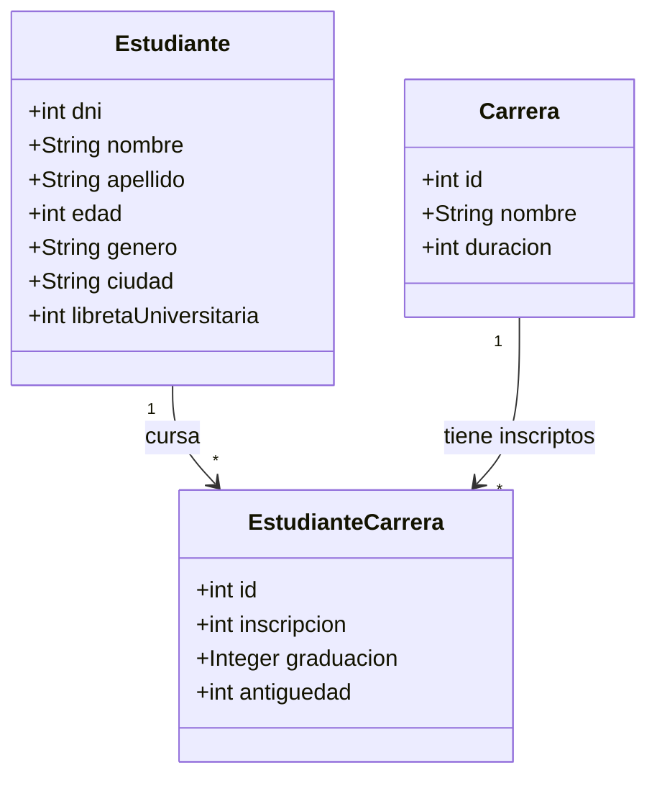
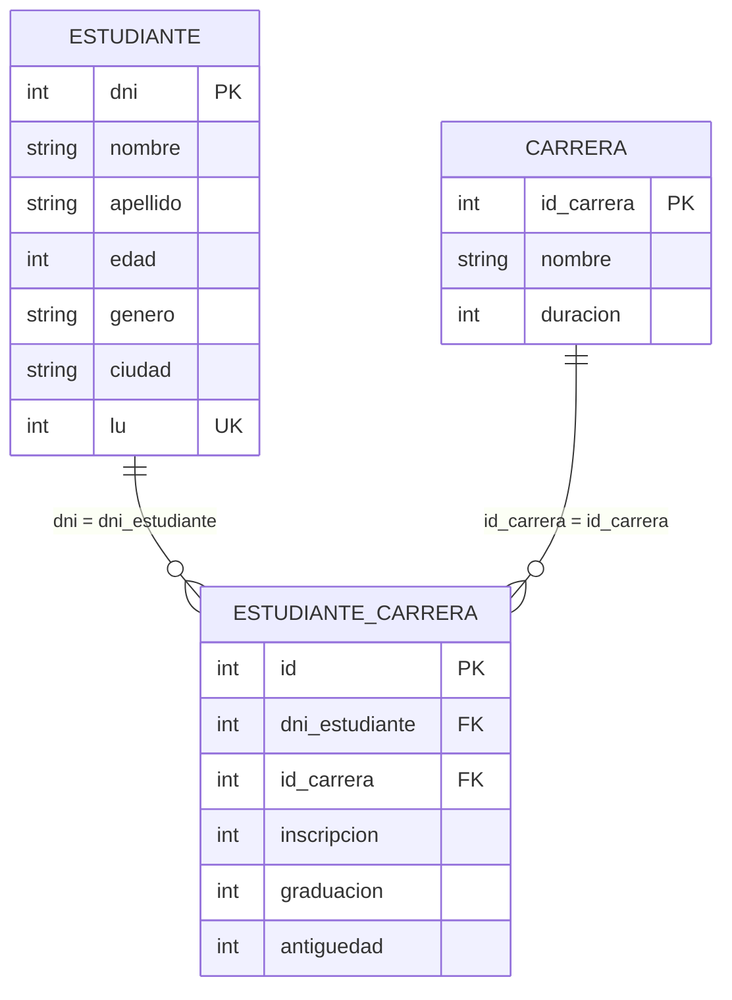

# TP2 — JPA / JPQL (Arquitecturas Web)

Proyecto nuevo **dentro del mismo repo** `ArquitecturaWeb`, carpeta `TP2/`.
No hizo falta crear un repo nuevo: se reusa el existente y cada integrante
trabaja en su rama + Pull Request.

## Estructura

```
TP2/
  pom.xml                        # Maven: Hibernate 6 + Derby + MySQL + commons-csv + lombok (Java 21)
  TP2-ArqWeb-ok.pdf              # consigna
  *.csv                          # datos integrador
  src/main/java/tp2/
    entity/Estudiante.java, Carrera.java, EstudianteCarrera.java  # integrador (listo)
    repository/EstudianteRepository.java  # consultas a-g + reporte (con TODOs)
    repository/CarreraRepository.java
    util/JPAUtil.java, CargadorCSV.java
    Main.java
  src/main/resources/META-INF/persistence.xml  # derbyPU (default) + mysqlPU
```

## Cómo correr

```bash
cd TP2
mvn compile exec:java 2>&1 | head -n 100
# o especificando unidad y carpeta de CSVs:
# mvn compile
# mvn -q exec:java -Dexec.mainClass="tp2.Main" -Dexec.args="derbyPU ."
```

- `derbyPU` crea `TP2/derbyDB/` sola, sin instalar nada.
- `mysqlPU`: crear base `tp2_jpa` o dejar `createDatabaseIfNotExist=true`, ajustar user/pass en `persistence.xml`.

## Reparto participativo sugerido

| Quién | Rama | Tarea |
|---|---|---|
| A | `feature/tp2-altas-matriculas` | `matricular()` + `darDeAlta()` + `findAllOrdenados()` (ya hecho, verificar) |
| B | `feature/tp2-consultas-d-e` | `findByLibreta()` + `findByGenero()` |
| C | `feature/tp2-consultas-f-g` | `findCarrerasConInscriptosOrdenadas()` + `findEstudiantesPorCarreraYCiudad()` |
| D | `feature/tp2-reporte-csv` | `reporteCarrerasPorAnio()` + probar `CargadorCSV` |
| (después) | `feature/tp2-ej1-turnos` / `feature/tp2-ej3-futbol` | Entidades Turno/Dirección/Persona/Socio y Equipo/Jugador/Torneo |

## Flujo Git participativo (usando este repo)

```bash
# 1. Una vez: cada integrante clona y entra
git clone git@github.com:Pabloaguirre23/ArquitecturaWeb.git
cd ArquitecturaWeb
git pull origin main

# 2. Crear su rama (nunca commitear directo a main)
git checkout -b feature/tp2-consultas-d-e

# 3. Trabajar, commitear, subir
git add TP2/src/main/java/tp2/repository/EstudianteRepository.java
git commit -m "feat(tp2): implementa findByLibreta y findByGenero"
git push -u origin feature/tp2-consultas-d-e

# 4. En GitHub: Open Pull Request -> pedir review a otro compañero -> Merge a main
# 5. Todos actualizan antes de seguir:
git checkout main
git pull origin main
```

Reglas: 1 PR por tarea, commits chicos con prefijo `feat(tp2):`, `fix(tp2):`, y no subir `target/`, `derbyDB/`, `.DS_Store` (ya ignorados en `.gitignore` raíz).

## Nota datos sucios

`estudianteCarrera.csv` referencia `id_carrera` inexistentes (ej. 15, 11, 9) y usa `graduacion=0` = no graduado.
`CargadorCSV` los saltea con `[WARN]` y mapea 0 -> null. No borrar ese manejo.


# TP2 Integrador — Punto 1: diagrama de objetos y DER


## Diagrama de objetos (modelo de dominio)



Un estudiante cursa N carreras y una carrera tiene N inscriptos (N—N
resuelta con la entidad intermedia `EstudianteCarrera`, que guarda
`inscripcion`, `graduacion` (null = no graduado) y `antiguedad`).

## DER (tablas y claves)


